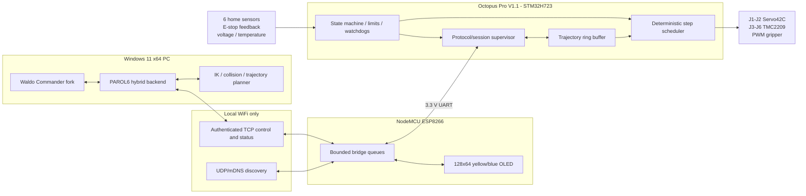
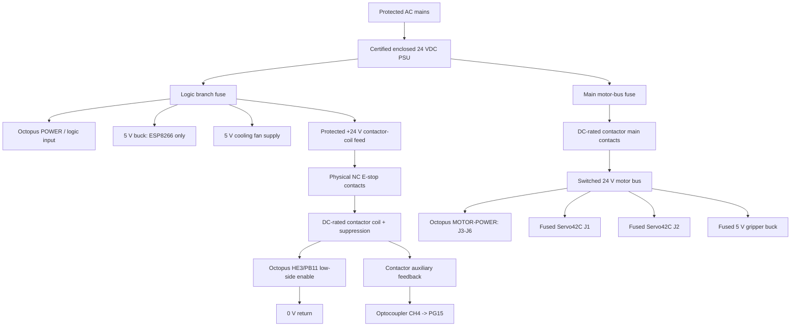

# PAROL6 Matt J - Final Software and Firmware Implementation Plan

**Document status:** Implementation-ready plan, revision 1
**Prepared:** 2026-08-08
**Target implementation environment:** GPT-5.6 Sol in Codex on Windows 11 x64
**Target robot:** Matt J's custom PAROL6
**Primary output directory:** `C:\Users\mattj\Documents\PAROL 6\SOFTWARE-FIRMWARE`

> [!IMPORTANT]
> **Owner amendment — 2026-08-17:** Initial commissioning and normal early
> development will use a direct Windows PC → Octopus USB-C connection. The
> ESP8266, its 5 V supply, and Octopus USART2 wiring are deferred and remain
> disconnected. USB CDC is therefore the primary transport for Phases 2, 3, 5,
> 6, and the initial Phase 8 work. Phase 4 becomes optional follow-on work. This
> amendment supersedes references below that describe WiFi/ESP as the normal
> initial control path; the protocol and MCU-side safety behavior remain the
> same.

> [!IMPORTANT]
> **Owner amendment — 2026-08-19:** J1 and J2 Servo42C modules will be operated
> permanently in local open-loop STEP/DIR mode (`CR_OPEN`). Encoder telemetry,
> encoder polling, and encoder-dependent faulting are disabled in the current
> runtime configuration. The encoder data structures and dormant integration
> code remain in the source for a future re-enable; they must not be presented
> as active feedback in this release.

> [!CAUTION]
> This is an experimental robot, not a certified machine or safety system. It has electrical, unexpected-motion, pinch, crush, heat, and stored-energy hazards. The physical E-stop circuit, contactor, fusing, protective earth, enclosure, wire sizing, and mains wiring must be designed and checked by a qualified person. Software, WiFi, the ESP8266, and ordinary Octopus outputs are not safety-rated. Read [SAFETY_WARNING_AND_DISCLAIMER.md](../SAFETY_WARNING_AND_DISCLAIMER.md) before any physical work.

---

## 1. Executive decision

Build a purpose-designed controller stack rather than using Klipper:

1. A custom, deterministic STM32H723 firmware will run on the BIGTREETECH Octopus Pro V1.1.
2. The Windows PC will run Waldo Commander, kinematics, collision checking, path planning, simulation, program execution, logging, and the robot backend.
3. Direct USB CDC from the Windows PC to the Octopus is the initial primary transport. The optional NodeMCU ESP8266 bridge/display is deferred until the owner resumes Phase 4.
4. The Octopus will buffer short, time-bounded trajectory segments and generate all step pulses locally. WiFi timing will never directly determine step timing.
5. J1 and J2 will use MKS SERVO42C V1.0 in local open-loop STEP/DIR mode (`CR_OPEN`). The encoder data model remains in the source, but encoder polling, display, and encoder-dependent faulting are disabled for this release.
6. J3-J6 will use TMC2209 V1.3 modules in UART-configured STEP/DIR mode.
7. The gripper will use a positional 180-degree MG90S or equivalent. It will not use the original CAN gripper protocol.
8. The physical E-stop will remove actuator power while leaving the Octopus logic, ESP8266, communications, and displays powered.

Item 8 is the implementation of the owner's "kill motor power only" requirement: the switched domain includes every motion-producing actuator (J1-J6 and the gripper), while controller/diagnostic power stays on. It does not mean that the marked E-stop switch should interrupt the motor current directly.

Klipper is not selected because its normal architecture requires a continuously running Linux `klippy` host. The stated design has a Windows PC and an ESP8266 bridge, not a Linux single-board computer. A custom H723 controller is therefore the cleanest way to keep hard timing and protective behavior on the robot controller.

### 1.1 Target runtime architecture



### 1.2 Non-negotiable design rules

- No motion at boot, reset, reconnect, firmware update, or protocol negotiation.
- No automatic resume after a disconnect, queue underflow, E-stop, reset, or fault.
- The ESP may forward valid messages but may never invent, extrapolate, or replay motion.
- The Octopus must enforce homing state, hard-input behavior, soft limits, maximum rates, protocol freshness, and queue bounds independently of the PC.
- The PC remains responsible for IK, Cartesian planning, collision checking, and the user experience, but its output is treated as untrusted until validated by firmware bounds.
- Encoder values from J1/J2 are motor-shaft measurements. They must never be described as direct output-joint measurements.
- No final current, thermal threshold, servo endpoint, homing offset, or direction value is accepted until measured on the completed robot.
- All release inputs are pinned by immutable commit or checksum and all release artifacts are usable offline.

---

## 2. Confirmed owner configuration

The values in this section override earlier retained choices where they conflict.

| Function | Final selected hardware or behavior |
| --- | --- |
| Main controller | BIGTREETECH Octopus Pro V1.1 with STM32H723 |
| Controller firmware | Custom firmware, not Klipper |
| PC | One Windows 11 x64 PC at a time |
| PC role | GUI, IK, FK, collision checking, path planning, simulation, programs, logs |
| Wireless bridge | NodeMCU ESP8266 V3, ESP-12F, CH340, USB-C, integrated 0.96-inch OLED |
| Network modes | Existing WiFi infrastructure and simultaneous/fallback access point |
| J1 | `3-17HE19-2004S`, MKS SERVO42C V1.0, Octopus MOTOR0 |
| J2 | `3-17HE19-2004S`, MKS SERVO42C V1.0, Octopus MOTOR1 |
| J3 | `17HS16-2004S`, BTT TMC2209 V1.3, Octopus MOTOR2 |
| J4 | `17HS16-2004S`, BTT TMC2209 V1.3, Octopus MOTOR3 |
| J5 | `17HS16-2004S`, BTT TMC2209 V1.3, Octopus MOTOR4 |
| J6 | `17HS08-1004S`, BTT TMC2209 V1.3, Octopus MOTOR5 |
| Reductions | Stock PAROL6 reductions for all six joints |
| J1/J2 GUI display | Commanded output-joint angle is primary; raw encoder angle is alongside it |
| Gripper | Positional 180-degree MG90S or electrically/mechanically compatible equivalent |
| Home sensors | Current PAROL6 BOM sensor set and stock joint locations |
| Proximity interface | Four-channel, isolated, nominal 24 V input to 3.3 V NPN output module from the `DST-1R2/4/8P-N` family; expected four-channel marking `DST-1R4P-N` |
| Physical E-stop | Owner's AC 660 V / 10 A marked E-stop switch; actuator power only is removed |
| Installation | One-click, offline-capable Windows release |
| Excluded compatibility | Legacy 3 Mbaud PAROL packet and original CAN gripper are not required |

### 2.1 Required hardware-verification gates

These are not optional questions. They are implementation/commissioning gates that must be recorded in `docs/HARDWARE_VERIFICATION.md` before the affected output is enabled.

| Gate | Required evidence | Blocks |
| --- | --- | --- |
| HV-01 | Photo of Octopus MCU marking and V1.1 board revision; continuity check against official schematic | Any Octopus firmware flash |
| HV-02 | Exact Servo42C firmware version, menu dump, motor phase pairing, magnet alignment, and UART command/response capture | J1/J2 powered motion and encoder polling |
| HV-03 | Integrated OLED controller, resolution, I2C address, SDA/SCL pins, and confirmation that it is a yellow-top/blue-bottom panel | Final ESP display driver |
| HV-04 | Optocoupler silkscreen and measured input/output truth table at 24 V and 3.3 V | Proximity sensors and contactor feedback |
| HV-05 | Exact positional servo model, stall current, allowed voltage, safe pulse endpoints, linkage geometry, and open/closed calibration | Gripper power and PWM |
| HV-06 | DC ratings for contactor main contacts and coil, auxiliary-contact arrangement, E-stop contact blocks, suppression, and manual restart behavior | Any motor-bus power |
| HV-07 | PSU rating, measured 24 V rail, branch fuse plan, wire gauges, connector ratings, and estimated load budget | Multi-axis operation |
| HV-08 | Completed-robot direction, homing trigger polarity, measured homing offsets, soft-limit margins, and collision-free standby pose | Normal-speed motion |

If a gate is incomplete, the software must report `NOT_COMMISSIONED` and keep the related output disabled. A TODO in a document is not evidence that a gate passed.

---

## 3. Scope and feature-parity target

### 3.1 Required functions

- Six-axis joint-space motion.
- Joint and Cartesian jogging, including press-and-hold dead-man behavior.
- MoveJ, MoveL, curved/spline motions already exposed by the PAROL6 Python API, blending, pause/hold, resume, controlled stop, and command completion tracking.
- FK, IK, joint limits, TCP/tool offsets, reachability checks, collision checking, dry-run preview, simulation, timeline playback, and Python programs.
- Bounded multi-stage homing with six physical home inputs.
- Hardware motor-power state, physical E-stop/contact feedback, software motor-off, fault latching, and explicit recovery.
- Two generic digital inputs and two generic low-side outputs, with the final connectors documented.
- Motor-bus voltage measurement and calibrated reporting.
- TMC2209 configuration and diagnostic reporting for J3-J6.
- J1/J2 Servo42C raw encoder telemetry, unwrapped motor position, estimated output-joint position, freshness, and following error when qualified.
- Positional PWM gripper support in Commander, including calibrated open/close/position commands.
- Controller/bridge firmware versions, board identity, queue depth, link health, fault log, sensor states, and temperature telemetry.
- NodeMCU OLED connection state, latency, and verified data-rate display.
- Direct USB service/recovery transport in addition to normal WiFi control.
- Offline one-click Windows installation, update, diagnostics, backup, and rollback.

### 3.2 Explicitly excluded

- Klipper and a Linux `klippy` host.
- Compatibility with the upstream custom STM32F446 PAROL control board pinout.
- Compatibility with the legacy `FF FF FF ... 01 02` 3 Mbaud packet.
- Original PAROL CAN gripper protocol.
- Multi-PC simultaneous control. The protocol still enforces one control lease to prevent accidental duplicate clients.
- Claiming functional safety, a certified E-stop, certified safe torque off, or compliance with CE/UL/CSA/ISO robot-safety standards.
- Treating Servo42C motor-side feedback as an output-joint absolute encoder.
- Reporting fabricated gripper position or current feedback when the selected servo does not provide it.

### 3.3 Parity matrix

| Upstream/Commander capability | Final implementation |
| --- | --- |
| Six steppers and homing | Reimplemented on H723 for selected drivers and sensors |
| Joint/Cartesian motion | Retained from pinned Python API and adapted to buffered transport |
| Simulation and path preview | Retained |
| Collision checking | Retained, then validated against the assembled tool and cable limits |
| Two inputs/two outputs | Retained with Octopus pin reservations and isolated-interface guidance |
| Physical E-stop status | Reimplemented as motor-contactor feedback plus latched controller state |
| Bus-voltage status | Reimplemented with external divider to Octopus ADC |
| Temperature error flags | Improved with actual NTC inputs and TMC diagnostics |
| Original board power latch | Replaced by explicit motor-contactor enable/inhibit behavior |
| CAN electric gripper | Replaced by local PWM positional-servo tool |
| Legacy serial packet | Replaced by versioned COBS/CRC protocol |
| J1/J2 encoder display | New capability |
| WiFi/OLED bridge | New capability |

---

## 4. Immutable source baseline

All implementation work must start from these reviewed sources. Forks must preserve their upstream license and pin the exact parent commit in `THIRD_PARTY_LOCK.md`.

| Source | Required baseline |
| --- | --- |
| Local official PAROL6 checkout | Commit `77597de127a844990965189f0e6062e2551a2842` |
| Waldo Commander | `Jepson2k/Waldo-Commander` commit `d5acbe1bea86cf1f207b8e912b8e36f9d7dbaf91` |
| PAROL6 Python API | Tag `0.4.0`, commit `829c2c73051c18d9cbf2e4cb07508a1557f63294` |
| waldoctl | Tag `v0.7.0`, commit `9ceab01e9b43495f4115cda90d26563220a1466a` |
| MKS Servo42C reference | `makerbase-mks/MKS-SERVO42C` commit `31471153111fc991fb6f4e6cab2690912b2f79a5` |
| BTT Octopus Pro reference | `bigtreetech/BIGTREETECH-OCTOPUS-Pro` commit `60a01f412959b62c349ba00da15b45232b7d90c5` |

Source precedence for robot facts remains the order in [PAROL6_PROJECT_KNOWLEDGE.md](../PAROL6_PROJECT_KNOWLEDGE.md), with the owner configuration in Section 2 of this plan overriding older owner selections.

Implementation rules:

- Replace version tags in build manifests with immutable commit hashes.
- Commit a lockfile, wheelhouse manifest, firmware-toolchain manifest, SBOM, and SHA-256 release manifest.
- Do not copy upstream currents, pin assignments, E-stop behavior, CAN behavior, or homing code into this controller without adapting and testing it.
- The upstream firmware's missing CRC enforcement, weak timeout behavior, non-enforced range fields, E-stop weakness, and homing assignment defects are reference warnings, not implementation templates.
- Keep GPLv3 notices for the PAROL6/Waldo-derived work and review every bundled binary's redistribution terms before producing the offline installer.

The existing local `quick_motor_step_gui` must be preserved only as a historical bench artifact. It was written for a TMC2209 in MOTOR0, whereas this build assigns MOTOR0 to the J1 Servo42C interface. Do not include it in the production launcher, reuse its MOTOR0 assumptions, or connect it to the completed robot. If it remains in the repository, label it `legacy/non-production` and require an explicit bench-only configuration.

---

## 5. Target repository and release layout

The implementation should turn the `SOFTWARE-FIRMWARE` folder into one versioned project with this structure:

```text
SOFTWARE-FIRMWARE/
|-- README.md
|-- FINAL_SOFTWARE_FIRMWARE_IMPLEMENTATION_PLAN.md
|-- CHANGELOG.md
|-- LICENSES/
|-- THIRD_PARTY_LOCK.md
|-- RELEASE_MANIFEST.json
|-- pyproject.toml
|-- uv.lock
|-- config/
|   |-- robot.default.yaml
|   |-- hardware.default.yaml
|   |-- protocol.yaml
|   `-- schema/
|-- shared/
|   |-- protocol/
|   |-- generated/
|   `-- test_vectors/
|-- firmware/
|   |-- octopus_h723/
|   |   |-- boards/octopus_pro_v1_1_h723/
|   |   |-- src/
|   |   |-- tests/
|   |   |-- platformio.ini
|   |   `-- README.md
|   `-- esp8266_bridge/
|       |-- src/
|       |-- boards/
|       |-- tests/
|       |-- platformio.ini
|       `-- README.md
|-- windows/
|   |-- parol6_backend/
|   |-- waldo_commander/
|   |-- waldoctl/
|   |-- wheelhouse/
|   `-- runtime/
|-- tools/
|   |-- commissioning/
|   |-- protocol_analyzer/
|   |-- firmware_flash/
|   `-- diagnostics/
|-- installer/
|   |-- inno/
|   |-- assets/
|   `-- portable/
|-- scripts/
|   |-- bootstrap-dev.ps1
|   |-- build-all.ps1
|   |-- test-all.ps1
|   |-- package-release.ps1
|   |-- flash-octopus.ps1
|   `-- flash-esp8266.ps1
|-- docs/
|   |-- ARCHITECTURE.md
|   |-- PROTOCOL.md
|   |-- WIRING_GUIDE.md
|   |-- INSTALL_WINDOWS.md
|   |-- FLASH_OCTOPUS.md
|   |-- FLASH_ESP8266.md
|   |-- COMMISSIONING.md
|   |-- HARDWARE_VERIFICATION.md
|   |-- SAFETY_CASE_NOTES.md
|   `-- TROUBLESHOOTING.md
|-- tests/
|   |-- unit/
|   |-- integration/
|   |-- hardware_in_loop/
|   |-- fault_injection/
|   `-- release/
`-- dist/
    |-- PAROL6-Commander-Setup-x64.exe
    |-- PAROL6-Commander-Portable-x64.zip
    |-- octopus_h723_firmware.bin
    |-- esp8266_bridge_firmware.bin
    `-- SHA256SUMS.txt
```

Generated output must never be the only copy of a schema or calibration value. Human-readable source and generation scripts are required.

---

## 6. Motion and kinematic constants

### 6.1 Baseline reductions and step conversion

Use 200 full steps/revolution and 32 input microsteps as the initial common configuration. This preserves the reviewed PAROL6 Python API conversion and reduces migration risk. TMC2209 interpolation to 256 microsteps may be enabled, but the controller's logical input resolution remains 32.

| Joint | Stock reduction | Logical steps/degree at 32 microsteps | Degrees/logical step | Initial max step rate from API |
| --- | ---: | ---: | ---: | ---: |
| J1 | 6.4 | 113.777778 | 0.008789063 | 15,000 steps/s |
| J2 | 20.0 | 355.555556 | 0.002812500 | 25,000 steps/s |
| J3 | `20 * 38/42 = 18.0952381` | 321.693122 | 0.003108553 | 32,000 steps/s |
| J4 | 4.0 | 71.111111 | 0.014062500 | 10,000 steps/s |
| J5 | 4.0 | 71.111111 | 0.014062500 | 10,000 steps/s |
| J6 | 10.0 | 177.777778 | 0.005625000 | 27,000 steps/s |

The first powered commissioning profile must cap speed, acceleration, and jerk at 10% of these software maxima. Raise the cap through 25%, 50%, 75%, and 100% only after the relevant mechanical, thermal, homing, following-error, and stop tests pass.

### 6.2 Baseline joint limits and standby pose

Use these reviewed Python API values as the starting software envelope, then reduce them if the completed build, cable routing, gripper, or physical stops require more margin.

| Joint | Initial software minimum | Initial software maximum | Standby after home |
| --- | ---: | ---: | ---: |
| J1 | -123.046875 deg | +123.046875 deg | +90 deg |
| J2 | -145.0088 deg | -3.375 deg | -90 deg |
| J3 | +107.866 deg | +287.8675 deg | +180 deg |
| J4 | -105.46975 deg | +105.46975 deg | 0 deg |
| J5 | -90 deg | +90 deg | 0 deg |
| J6 | 0 deg | +360 deg | +180 deg |

J6 is not to be treated as electrically or mechanically continuous. The internal cable path and tool wiring remain limited even if a URDF calls the joint continuous. J1's mechanical rotation blocker is mandatory.

### 6.3 Coordinate and calibration rules

- `commanded_joint_deg` is the primary Commander and 3D-view value.
- Firmware stores commanded position as signed 64-bit logical microsteps.
- PC planning uses radians internally and converts only at the hardware-transport boundary.
- Each joint has a configured direction sign, home-sensor polarity, switch-seek direction, trigger offset, standby angle, and final soft limits.
- Direction signs and offsets are measurements, not values to infer from connector wire colors.
- The stock URDF is the geometry starting point. Its joint limits are not safety limits and must not override this table.
- Validate FK against at least five measured assembled-robot poses and validate the tool-center offset for the selected gripper.
- Save calibration with a schema version, robot serial, firmware compatibility range, timestamp, operator, source measurements, and CRC.

---

## 7. Octopus H723 firmware design

### 7.1 Build platform

- Language: C++17 with a small C-compatible hardware abstraction boundary.
- Framework: pinned STM32CubeH7 CMSIS/HAL for startup, clocks, DMA, USB, ADC, SD, and basic peripherals; use LL/direct-register code only where measured timing requires it.
- Build: PlatformIO with a project-local custom board definition and linker script, plus host CMake tests for hardware-independent modules.
- Target: STM32H723, 25 MHz external crystal, BTT 128 KiB bootloader offset.
- Link application at `0x08020000`; verify flash size from the exact MCU marking before finalizing the linker length.
- Output: deterministic `firmware.bin`, ELF, MAP, symbols, build metadata, SHA-256, and protocol/config versions.
- Do not introduce an RTOS unless measurement proves the cooperative/interrupt design cannot meet timing. If added, its scheduling and priority-inversion behavior require a new timing review.

### 7.2 Authoritative Octopus pin allocation

This table is the target logical map. The official V1.1 schematic and continuity on the owner's board must confirm it under HV-01.

| Function | Connector | MCU pin | Notes |
| --- | --- | --- | --- |
| J1 STEP | MOTOR0 | PF13 | Servo42C interface breakout, not motor output terminal |
| J1 DIR | MOTOR0 | PF12 | Servo42C interface breakout |
| J1 EN | MOTOR0 | PF14 | Default disabled; polarity verified at HV-02 |
| J2 STEP | MOTOR1 | PG0 | Servo42C interface breakout |
| J2 DIR | MOTOR1 | PG1 | Servo42C interface breakout |
| J2 EN | MOTOR1 | PF15 | Default disabled; polarity verified at HV-02 |
| J3 STEP/DIR/EN | MOTOR2 | PF11 / PG3 / PG5 | BTT TMC2209 V1.3 |
| J4 STEP/DIR/EN | MOTOR3 | PG4 / PC1 / PA2 | V1.1 uses PA2 for MOTOR3 enable |
| J5 STEP/DIR/EN | MOTOR4 | PF9 / PF10 / PG2 | BTT TMC2209 V1.3 |
| J6 STEP/DIR/EN | MOTOR5 | PC13 / PF0 / PF1 | BTT TMC2209 V1.3 |
| J3 TMC UART | MOTOR2 UART | PC6 | One-wire UART |
| J4 TMC UART | MOTOR3 UART | PC7 | One-wire UART |
| J5 TMC UART | MOTOR4 UART | PF2 | One-wire UART |
| J6 TMC UART | MOTOR5 UART | PE4 | One-wire UART |
| J1 home | STOP0 | PG6 | M5 NPN-NO through optocoupler channel 1 |
| J2 home | STOP2 | PG10 | ZW12-3 dry NC contact; owner-verified as-built override |
| J3 home | STOP4 | PG12 | ZW12-3 dry NC contact; owner-verified as-built override |
| J4 home | STOP3 | PG11 | 4 mm NPN-NO through optocoupler channel 2 |
| J5 home | STOP1 | PG9 | ZW12-3 dry NC contact; owner-verified as-built override |
| J6 home | STOP5 | PG13 | GX-F8A through optocoupler channel 3 |
| Spare limit/DI | STOP6 | PG14 | Reserved, normally unpopulated |
| Motor-contactor feedback | STOP7 | PG15 | Through optocoupler channel 4 |
| ESP UART TX/RX | Raspberry Pi header USART2 | PD5 / PD6 | Octopus TX to ESP RX; Octopus RX from ESP TX |
| Servo42C telemetry TX/RX | SPI3/UART3 header | PD8 / PD9 | Shared addressed bus after qualification |
| Gripper PWM | Probe servo pin | PB6 | Signal only; never power servo from this header |
| Motor-bus voltage ADC | Power-Det | PC0 | External protected divider required |
| Temperature 0-3 | T0-T3 | PF4 / PF5 / PF6 / PF7 | 100k NTC assignments below |
| Optional temperature 4 | TB | PF3 | Reserved for gripper or additional motor |
| Generic DO1/DO2 | FAN0/FAN1 | PA8 / PE5 | Low-side outputs; load voltage/current verified |
| Motor-contactor coil inhibit | HE3 | PB11 | Low-side coil control only after circuit review |
| USB service | Board USB-C | PA11 / PA12 | CDC protocol/diagnostics and recovery |
| Status RGB | RGB header | PB10 | Optional non-safety status indication |

Pins on EXP1/EXP2 for the two generic DIs are to be chosen only after schematic validation and a connector daughterboard design. The preferred candidates are PE8 and PE7 as local dry-contact inputs with pull-ups. External or long-cable 24 V inputs require another isolator; they must not connect directly to MCU pins.

### 7.3 Firmware module boundaries

Create small modules with explicit ownership and host-testable logic:

```text
bsp/              clocks, GPIO, DMA, UART, USB, ADC, SD, watchdog
protocol/         COBS, CRC32C, message codec, session and sequence validation
safety/           state machine, fault latch, watchdogs, sensor qualification
motion/           segment queue, interpolation, rate validation, step scheduler
drivers/          TMC2209 UART, Servo42C UART telemetry, PWM gripper
homing/           per-joint bounded homing state machines and sequence coordinator
io/               limits, generic I/O, motor contactor, voltage, NTC temperatures
config/           compiled ceilings, dual-slot calibrated configuration and CRC
diagnostics/      counters, event log, build info, self-tests
transport/        USART2 ESP, USB CDC service, control-session arbitration
```

No module may directly enable a driver except through the safety supervisor.

### 7.4 Controller state machine

Required states:

| State | Motor bus | Step outputs | Entry/exit behavior |
| --- | --- | --- | --- |
| `BOOT_SELF_TEST` | Requested off | Disabled | Check reset reason, config CRC, inputs, ADC plausibility, UARTs, watchdog |
| `NOT_COMMISSIONED` | Off | Disabled | Missing required hardware/calibration gates |
| `DISARMED` | Off | Disabled | Normal safe idle and firmware-update state |
| `ARMING` | Requested on | Disabled | Wait for verified contactor feedback and stable motor voltage |
| `UNHOMED` | On | Disabled except homing | Explicit home required |
| `HOMING` | On | Homing axis/axes only | Bounded seek/backoff/latch sequence |
| `READY` | On | Enabled, stationary | Accept validated motion or gripper commands |
| `EXECUTING` | On | Enabled | Consume committed trajectory segments |
| `HOLDING` | On | Enabled or reduced hold | Controlled deceleration complete; explicit resume if queue valid |
| `PROTECTIVE_STOP` | Policy-dependent | Disabled after controlled stop | Queue cleared; explicit reset and usually rehome |
| `ESTOP_LATCHED` | Off by hardware | Disabled immediately | Physical release plus explicit reset; always rehome |
| `FAULT_LATCHED` | Off for severe faults | Disabled | Root cause and explicit reset required |
| `UPDATE_MODE` | Off | Disabled | Only signed/hashed local update workflow |

Important transition rules:

- The contactor output defaults off at reset and after any watchdog reset.
- Releasing the physical E-stop must not automatically energize the motor bus.
- A reconnect may restore status only; it cannot restore motor power, homed state, a queue, or execution.
- Any observed motor-power loss invalidates homing because the arm may have moved.
- A software stop first generates a bounded deceleration when possible, then disables pulses. A physical E-stop may remove power immediately; firmware records the event but cannot guarantee deceleration.
- A queue underflow while moving generates an on-controller deceleration using compiled acceleration ceilings, then enters `PROTECTIVE_STOP`.

### 7.5 Trajectory buffer and step generation

- PC planner output remains jerk-limited and sampled at a nominal 100 Hz.
- Transfer points in batches, not one WiFi packet per motion tick.
- Each point contains six signed target-step positions, six optional endpoint velocities, a relative duration, trajectory ID, point index, and flags.
- Octopus ring-buffer capacity: at least 512 points, statically allocated.
- Normal queued horizon: 200-400 ms.
- Minimum execution horizon before starting a planned move: 150 ms, except bounded jog/servo modes.
- Maximum accepted horizon: 1,000 ms. Reject additional data instead of creating a long, uninterruptible backlog.
- Commit a trajectory only after all points in the initial safe horizon validate and the start position matches within tolerance.
- Validate monotonic point indices, duration bounds, position limits, per-axis delta/rate, velocity, acceleration, jerk ceiling, and total queue capacity.
- Generate step edges from a high-priority hardware timer using integer/fixed-point math. Main-loop or UART work must not alter pulse timing.
- Target STEP pulse high and low times: at least 4 microseconds until both TMC2209 and Servo42C measurements prove a smaller value is safe.
- Use one direction setup interval before the first step after direction change.
- Store 64-bit commanded step positions even if a wire message uses 32-bit relative deltas.
- Instrument maximum interrupt latency, missed scheduler deadlines, pulse count, queue low-water mark, rejected segment count, and controlled-stop cause.

Do not rely on WiFi, TCP arrival cadence, Python scheduling, or ESP loop timing for pulse generation.

### 7.6 TMC2209 J3-J6 configuration

- Install TMC2209 modules only in MOTOR2-MOTOR5 and verify orientation with power off.
- Configure the Octopus jumpers for each slot's UART mode according to the board schematic.
- Remove/avoid DIAG-to-endstop sensorless-homing jumpers. Physical home sensors are authoritative.
- Use 32 logical microsteps and enable 256-microstep interpolation if it passes noise/torque tests.
- Start in SpreadCycle for predictable torque. StealthChop may be evaluated later at low speed but cannot become the default until stall and heat tests pass.
- Disable CoolStep and StallGuard-based protective decisions during initial commissioning.
- Read and report `GSTAT`, `DRV_STATUS`, overtemperature prewarning/shutdown, short/open-load indications where meaningful, and `IFCNT` write verification.
- Poll diagnostics at 5-10 Hz, outside the step ISR.
- A failed driver configuration readback blocks arming that joint.

Provisional RMS run-current plan, subject to HV-07 and thermal testing:

| Joint | Motor rating reference | Safe commissioning start | Tuning rule |
| --- | --- | ---: | --- |
| J3-J5 | 2.0 A/phase, 45 Ncm class | 0.70 A RMS | Raise by 0.10 A only when load testing proves need and temperatures pass; initial ceiling 1.20 A RMS |
| J6 | 1.0 A/phase, 13 Ncm class | 0.45 A RMS | Raise by 0.05 A; initial ceiling 0.70 A RMS |

Use 40-60% hold current initially. Final values belong in calibrated configuration, not only in source code. The selected PLA+ structure warrants conservative current and real temperature measurement.

### 7.7 Servo42C J1/J2 operation and dormant encoder code

Target settings after HV-02:

- Mode: local open-loop STEP/DIR (`CR_OPEN`). Set this independently on both
  Servo42C boards using their onboard menu; the Octopus cannot change the
  board-local mode through STEP/DIR.
- Logical microstep setting: 32. This must remain aligned with J1/J2's stored
  pulses-per-degree conversion.
- Supply: switched 24 V motor bus, within the board's verified input range.
- Current: for J2 gravity-lift commissioning, begin with Servo42C `Ma=1600 mA`
  in `CR_OPEN`. Increase only after loaded motion and temperature checks, never
  above the motor's 2 A/phase rating. The Octopus STEP/DIR interface cannot set
  this board-local current.
- J2 pulse demand: maximum 350 pulses/s and 900 pulses/s^2 during initial lift
  commissioning; this is about 0.98 joint degrees/s at 356 pulses/degree.
- J1 UART address: 1; J2 UART address: 2.
- UART: 38,400 baud, 8N1, exact checksum/response behavior captured in a golden trace.
- Control signals: use a small keyed interface board from MOTOR0/MOTOR1 logic pins. Do not install plug-in drivers in those slots and do not use the Octopus A/B motor output terminals.
- Prefer open-drain, active-low STEP/DIR/EN signaling with Servo42C `COM` at 3.3 V, plus verified pull-ups so reset defaults to no step and disabled. The final polarity must come from the installed board's measurements.

Encoder integration policy for this release:

- `ENCODER_INTEGRATION_ENABLED` is `false`.
- Do not wire or poll the shared USART3 telemetry bus for normal operation.
- Do not display encoder values or use following error for a stop/fault.
- Keep the encoder status structures, conversion math, and protocol types in
  the source tree as dormant code so a later hardware-qualified re-enable does
  not require a schema rewrite.
- Commanded joint position remains the only software position estimate; missed
  steps and overloads are not detected by the controller.

### 7.8 Homing implementation

The stock physical arrangement is:

| Joint | Sensor | Normal electrical strategy | Target STOP input |
| --- | --- | --- | --- |
| J1 | Threaded M5 NPN-NO inductive sensor (`Sensor 3`) | 24 V sensor through optocoupler | STOP0 / PG6 |
| J2 | ZW12-3 mechanical switch | COM+NC dry contact to signal/GND | STOP2 / PG10 |
| J3 | ZW12-3 mechanical switch | COM+NC dry contact to signal/GND | STOP4 / PG12 |
| J4 | 4 mm NPN-NO inductive sensor (`Sensor 2`) | 24 V sensor through optocoupler | STOP3 / PG11 |
| J5 | ZW12-3 mechanical switch | COM+NC dry contact to signal/GND | STOP1 / PG9 |
| J6 | GX-F8A flat inductive sensor (`Sensor 1`) | 24 V sensor through optocoupler | STOP5 / PG13 |

Each joint uses this bounded state sequence:

1. Confirm motor bus, E-stop feedback, sensor plausibility, configured direction, and conservative speed profile.
2. If sensor is already active, back off slowly with a maximum distance/time. Failure to clear is a latched fault.
3. Fast seek toward the sensor with independent distance and time bounds.
4. Stop, back off until clear plus a configured margin.
5. Slow seek for the repeatable latch edge.
6. Stop, save the raw latch step and J1/J2 motor encoder reading where available.
7. Apply the measured home offset and verify it remains inside compiled hard ceilings.
8. Move to the configured standby angle at commissioning speed.
9. Record duration, travel, first/second latch difference, and faults.

Owner-selected J2/J3 commissioning behavior: both joints may start with their
mechanical switches active because they rest at home. An active input at startup
is never sufficient to declare the axis homed; the release and slow re-latch
sequence remains mandatory. The repeatable latch edge is recorded as 0 degrees
and automatically stored as the minimum or maximum according to the configured
joint-positive and home directions. The operator captures only the opposite
limit. Motion away from an active, already-validated J2/J3 home input may clear
that input normally; a transition toward home or a re-trigger still aborts
motion.

The active-start release has a 30-degree maximum travel ceiling for the
owner's assembled J2/J3 geometry. It stops as soon as the debounced switch
clears; the ceiling exists only to terminate a wrong direction, stuck input, or
mechanical failure.

Initial completed-robot sequence: J1, J2, J3, J4, J6, J5, one joint at a time with the arm supported as needed. Only after collision and gravity tests may J1-J3 be evaluated for safe parallel homing. Never copy the upstream firmware's defective homing state assignments.

### 7.9 Voltage, temperature, I/O, and gripper

Motor-bus voltage:

- Measure the switched motor bus, not merely the always-on logic supply.
- Initial divider: 100 kOhm high side and 10 kOhm low side, 1% or better, with a 100 nF filter, series protection, and ADC clamp review.
- At 30 V this produces about 2.73 V, leaving margin below 3.3 V.
- Connect the conditioned node to PC0 on the Power-Det header and its reference to Octopus ground.
- Calibrate at two measured voltages and store slope/offset.
- Report millivolts and use separate warning/fault thresholds for undervoltage, overvoltage, and unexpected loss while moving.

Temperature inputs:

| Input | Proposed sensor location |
| --- | --- |
| T0 / PF4 | J1 motor case near the Servo42C, electrically insulated and mechanically secured |
| T1 / PF5 | J2 motor case near the Servo42C |
| T2 / PF6 | Hottest accessible J3/J4 motor or enclosure test point |
| T3 / PF7 | TMC2209/Octopus enclosure air or heatsink test point |
| TB / PF3 | Optional gripper/J6 or second enclosure point |

Use known 100 kOhm NTC parts with recorded beta/Steinhart-Hart coefficients. Begin with warning/derating/fault candidates of 50/55/60 C at the measured printed-part-adjacent location, then set final thresholds from PLA+ heat-soak evidence. A thermistor open/short is a fault, not a plausible temperature.

Gripper:

- PB6 carries PWM signal only.
- Power the servo from a dedicated regulated 5 V actuator supply downstream of the motor contactor, with local bulk capacitance and its own fuse.
- Do not power the servo from the Octopus probe 5 V pin or the ESP regulator.
- Common the servo signal ground to Octopus logic ground at the designed star point.
- Default to no pulses while disarmed; on arming, start at a calibrated safe/open command without a sudden endpoint jump.
- Store minimum/maximum pulse widths, mechanical open/close angles, inversion, slew rate, and maximum motion time in calibration.
- Use normalized 0.0=open to 1.0=closed in the backend.
- If the selected servo has no feedback, Commander must label the value `Commanded` and leave measured position/current/object detection unavailable.
- A feedback servo, jaw switches, or current sensor may be added later without changing the public normalized tool API.

Generic I/O:

- Implement two logical DIs and two logical DOs in firmware/protocol even if external connectors are populated later.
- DO1/DO2 use PA8/PE5 low-side outputs only with documented voltage, maximum load, flyback requirements, and fuse.
- Long-wire or 24 V DIs require optoisolation. Local dry contacts may use reviewed EXP header pins with pull-ups and protection.
- No generic output may energize automatically from a persisted state after reboot.

### 7.10 Configuration, logs, and firmware recovery

- Compile absolute safety ceilings into firmware.
- Store user calibration in two flash slots with sequence number, schema version, CRC32C, and atomic selection.
- Reject newer/unknown schemas and values outside compiled ceilings.
- Allow writes only while `DISARMED`, with a specific authenticated maintenance command.
- Keep a circular nonvolatile event log for reset cause, E-stop, motor-power loss, underflow, sensor fault, driver fault, overtemperature, protocol violation, and config changes.
- Do not continuously write high-rate telemetry to flash.
- Feed both independent and window watchdogs where available; deliberately test them.
- Use BTT's SD bootloader update flow for normal Octopus updates: FAT32 card, `firmware.bin`, power cycle/reset, and verify rename to `FIRMWARE.CUR`.
- USB DFU/SWD is the recovery path. Preserve SWD access and document ST-Link pinout.
- Firmware update is permitted only with motor bus off and step outputs disabled.

---

## 8. Communication protocol

### 8.1 Framing

Use one canonical binary protocol across PC-to-ESP, ESP-to-Octopus UART, and USB service, with transport-specific authentication where appropriate.

UART/USB frame:

```text
COBS(
  version_u16
  message_type_u8
  flags_u8
  payload_length_u16
  session_id_u32
  sequence_u32
  acknowledgement_u32
  sender_time_us_u64
  payload[...]
  crc32c_u32
) 0x00
```

Requirements:

- COBS delimiter guarantees deterministic resynchronization.
- CRC32C covers every unencoded byte except the CRC itself.
- Strict maximum frame length and payload-specific exact lengths.
- Protocol major mismatch blocks commands; minor capability negotiation is explicit.
- Sequence windows reject duplicates, reordering outside tolerance, and replay.
- Every command has a monotonically increasing 64-bit command ID and idempotent acknowledgement.
- No raw structure casts across platforms; generate explicit little-endian encoders/decoders.
- Commit golden byte vectors consumed by Python, H723, and ESP tests.
- Fuzz malformed COBS, length, enum, CRC, sequence, numeric-range, and queue messages.

TCP preserves byte order but still uses a length-delimited form of the same message body so logs and conformance tests remain shared.

### 8.2 Message families

Minimum messages:

- Discovery: `ANNOUNCE`, `GET_DEVICE_INFO`.
- Session: `HELLO`, `CHALLENGE`, `AUTH`, `TAKE_CONTROL`, `RELEASE_CONTROL`, `GOODBYE`.
- Health: `HEARTBEAT`, `HEARTBEAT_REPLY`, `TIME_SYNC`, `GET_COUNTERS`.
- Safety: `MOTOR_ENABLE`, `MOTOR_OFF`, `CONTROLLED_STOP`, `ESTOP_REQUEST`, `RESET_FAULT`.
- Homing: `HOME_START`, `HOME_CANCEL`, `HOME_RESULT`.
- Motion: `TRAJECTORY_BEGIN`, `TRAJECTORY_POINTS`, `TRAJECTORY_COMMIT`, `TRAJECTORY_CANCEL`, `JOG_UPDATE`, `SERVO_UPDATE`.
- Tool/I/O: `GRIPPER_SET`, `IO_WRITE`, `IO_READ`.
- Configuration: `CONFIG_READ`, `CONFIG_STAGE`, `CONFIG_VALIDATE`, `CONFIG_COMMIT`.
- Status: `STATUS_FAST`, `STATUS_SLOW`, `EVENT`, `LOG_LINE`.
- Maintenance: `SELF_TEST`, `ENTER_UPDATE`, `REBOOT`.

Every negative acknowledgement includes a stable error code, offending field, current state, and whether retry is allowed.

### 8.3 Link behavior and timeouts

- PC sends heartbeat requests at 10 Hz while it owns control.
- End-to-end heartbeat is acknowledged by the Octopus, not merely the ESP, so displayed latency covers the complete command path.
- ESP-to-Octopus UART starts at 921,600 baud, 8N1. Fall back to 460,800 only through explicit negotiation after a logged qualification failure.
- UART RX uses DMA/circular buffering; parsing occurs outside the step ISR.
- PC normally sends a fresh batch every 50 ms and maintains 200-400 ms of validated horizon.
- If PC control heartbeat is absent for 300 ms, ESP declares the controller stale and tells Octopus; Octopus begins a protective controlled stop.
- If Octopus UART heartbeat is absent for 150 ms, ESP reports MCU lost. Octopus independently detects receive freshness and stops based on its own timer.
- Any trajectory queue underflow during nonzero velocity invokes the local controlled-stop generator.
- Reconnection never replays unacknowledged motion. The new session starts status-only and must explicitly take control.

Final timeout values must be verified under WiFi impairment and cannot exceed the controller's available stopping horizon.

### 8.4 Authentication and local-only operation

- ESP AP uses WPA2 with a unique random password, not a fixed public default.
- PC and ESP share a per-robot 256-bit key provisioned on first setup.
- Use challenge-response HMAC-SHA256, session nonces, sequence numbers, and message authentication for control-capable TCP messages.
- Save the PC key using Windows DPAPI. Do not commit SSIDs, passwords, or keys.
- Bind Waldo's web UI and local backend server to `127.0.0.1` only.
- Do not implement cloud control, internet port forwarding, or unauthenticated browser control.
- One session may own control. Additional connections receive read-only health/status or are rejected.
- Direct USB service can take priority only while disarmed and only after an explicit local action.

### 8.5 Displayed link metrics

Define the requested OLED numbers precisely:

- `Latency`: median end-to-end PC -> ESP -> H723 -> ESP -> PC heartbeat round-trip over the last 20 valid samples; optionally show p95 in diagnostics.
- `Data speed`: verified application payload goodput after CRC/authentication, separately for receive and transmit, one-second rolling average in kB/s.
- `Connection`: `STA`, `AP`, `STA+AP`, `PC LOST`, `MCU LOST`, or `NO LINK`, plus controller state.
- WiFi RSSI is a separate diagnostic and must not be labeled latency.

---

## 9. ESP8266 bridge firmware

### 9.1 Technology and responsibilities

- PlatformIO with a pinned ESP8266 Arduino core and pinned display/network libraries.
- C++17 where supported by the selected toolchain.
- Hardware UART0 swapped to GPIO15 TX / GPIO13 RX after boot, subject to HV-03 board-pin verification.
- Integrated OLED on its discovered I2C pins; expected SSD1306-compatible 128x64 at address 0x3C or 0x3D, but discovery evidence is required.
- LittleFS dual-slot configuration with CRC and factory-reset procedure.
- Hardware/software watchdogs enabled and tested.

The ESP performs:

- STA+AP WiFi management.
- Device discovery and authenticated TCP session handling.
- Bounded frame validation and forwarding.
- Link statistics and OLED rendering.
- Configuration provisioning and local diagnostics.
- Firmware update/recovery while the Octopus remains disarmed.

The ESP does not perform IK, trajectory generation, step timing, homing decisions, limit decisions, driver enable decisions, or E-stop decisions.

### 9.2 WiFi behavior

- Start in `WIFI_AP_STA` mode.
- Attempt saved infrastructure networks without blocking the UART bridge.
- Always provide a configurable AP fallback, e.g. `PAROL6-MATTJ-<device suffix>`.
- Default AP address: `192.168.6.1/24`, changed if the detected STA network conflicts.
- Advertise `parol6-<suffix>.local` and respond to a small UDP discovery request.
- No dependency on DNS or internet access after provisioning.
- Limit to one control client and a small fixed number of read-only diagnostic clients.
- Apply bounded queues and backpressure. If the MCU cannot accept data, stop accepting trajectory points and report queue status; never accumulate an unbounded ESP backlog.
- Store multiple infrastructure profiles only if the UI can clearly show which one is active.

### 9.3 OLED layout

Assume one two-color 128x64 OLED, where the upper band is physically yellow and the remaining rows are blue. Confirm this under HV-03.

```text
Yellow rows 0-15:  PAROL 6 - MATT J
Blue rows 16-31:  READY  STA+AP
Blue rows 32-47:  RTT  12 ms  -61dBm
Blue rows 48-63:  RX 8.2  TX 3.1 kB/s
```

- The exact title must remain readable; use a compact font if necessary.
- Update network counters at 1 Hz and render at no more than 4 Hz.
- Never block the bridge to refresh the display.
- Show a clear fault code when PC, MCU, authentication, config, or UART is unavailable.
- During boot, show firmware version and self-test briefly, then transition to status.
- If OLED initialization fails, the bridge may remain available but must report the display fault to Commander.

### 9.4 ESP recovery and provisioning

- First flash uses USB-C/CH340 and bundled `esptool` from the Windows setup wizard.
- The setup wizard detects the CH340 COM port, flashes bootloader/partitions/application at pinned offsets, verifies flash, and reboots.
- First-run provisioning may use temporary AP/captive setup or serial provisioning. Never place credentials in command history or logs.
- Keep a physical factory-reset method documented, such as holding a verified button at boot.
- OTA is optional for the first release. If implemented, require authenticated upload, firmware hash, disarmed Octopus state, and automatic rollback on failed boot.
- Normal operation uses one 5 V source only. Prevent backfeeding when a PC USB cable is attached for programming.

---

## 10. Windows backend and Waldo Commander

### 10.1 Reuse strategy

Fork the reviewed PAROL6 Python API instead of rewriting its mature high-level functions. Retain:

- `waldoctl` robot/client contracts.
- Pinocchio/pinokin FK, IK, URDF display, and collision checking.
- Ruckig/TOPP-RA/quintic trajectory generation.
- MoveJ, MoveL, curves/splines, blending, jog, servo, dry-run, simulation, command queue, timeline, program scripts, and tests.
- Existing Waldo control lease, status streaming, I/O panel, gripper panel, editor, and MCP functions where safe.

Replace/adapt:

- Legacy serial transport and 3 Mbaud packet codec.
- Legacy automatic homing assumptions.
- COM-port-only settings with bridge discovery plus direct USB fallback.
- Legacy gripper CAN fields with the positional PWM tool.
- Status schema to expose motor power, state/faults, queue depth, voltage, temperature, link metrics, and J1/J2 encoder telemetry.

The local API/server remains bound to loopback. The hardware transport runs inside the backend server and connects outward to the ESP bridge.

### 10.2 Backend transport implementation

Add a `BridgeTransport` with:

- Discovery by device ID, mDNS, UDP, and manual IP fallback.
- HMAC session establishment and single-control lease.
- Async reader/writer tasks with bounded queues.
- Protocol version/capability negotiation.
- Batching from existing trajectory segments into the Octopus ring-buffer format.
- Status decoding into preallocated NumPy buffers.
- Direct USB CDC transport implementing the same message layer.
- No command retry after an uncertain motion acknowledgement; query command ID/state instead.
- Explicit cancellation and controlled-stop semantics.
- Reconnect in status-only mode.
- Packet capture with secrets removed and a deterministic playback/mock transport for tests.

Adapt the planner so the segment player maintains a target controller horizon rather than sending only the current point every 10 ms. Jog and Cartesian servo targets replace stale targets and include an explicit short expiry, matching Waldo's 20 Hz UI cadence.

### 10.3 Status model

Add a backward-compatible optional telemetry object rather than silently changing the meaning of every backend's `angles` field.

Required fields include:

```text
commanded_joint_deg[6]
commanded_joint_speed_rad_s[6]
encoder_raw[2]
encoder_motor_deg[2]
encoder_est_joint_deg[2]
encoder_following_error_deg[2]
encoder_age_ms[2]
encoder_valid[2]
encoder_mode[2]
controller_state
motor_power_requested
motor_power_verified
limit_bits
fault_code / fault_detail
queue_points / queue_horizon_ms
motor_bus_mv
temperatures_c[] / temperature_valid[]
tmc_status[4]
link_rtt_ms / link_rx_kB_s / link_tx_kB_s
firmware_versions and protocol_version
```

Set the existing main `StatusBuffer.angles` to commanded joint degrees so Commander, program capture, and the 3D model consistently show the owner's requested primary value. The encoder values remain clearly separate.

### 10.4 Commander UI changes

Use the reviewed Waldo Commander commit as the fork base. Preserve its current design and add only well-scoped extensions.

Primary Joint Jog screen:

- Keep the existing large/editable commanded angle as the primary J1-J6 value.
- For J1 and J2, add a compact adjacent line such as `ENC M +123.4 deg` and `EST J +19.3 deg`, with a tooltip explaining motor-side measurement and reduction.
- Show following error and sample age on hover or in a compact diagnostics expansion.
- Color telemetry neutral when live, amber when old/idle-only, red when invalid/faulted, and gray when unavailable.
- J3-J6 show no fake encoder values.
- Preserve keyboard/jog accessibility and the row's limit buttons.

Top-left/status area:

- Show `DISARMED`, `UNHOMED`, `READY`, `EXECUTING`, `HOLD`, `ESTOP`, or `FAULT` next to connection state.
- Add motor-power, bus-voltage, queue-horizon, and temperature indicators.
- Keep I/O chips and gripper tool indication.
- A disconnected browser must never look ready merely because its last status was ready.

Control behavior:

- `Enable Motor Power` is explicit and disabled until all prerequisites pass.
- `Home` requires verified motor power and released E-stop.
- Motion controls require `READY` and an active local control lease.
- `Esc` requests immediate software motor-off/protective stop; UI text must still tell the operator to use the physical E-stop for an emergency.
- After E-stop, power loss, or serious fault, disable resume and require reset plus home.
- Do not auto-run a queued program after reconnect.

Gripper:

- Register an `ElectricGripperTool`-compatible normalized interface.
- Display the selected servo's commanded normalized position and open/close buttons.
- Label it `CMD` until feedback hardware exists.
- Do not populate current/object-detected charts with synthetic values.

Settings/diagnostics:

- Device selector by robot name/ID and IP, with USB fallback.
- Infrastructure/AP provisioning shortcut.
- Firmware versions and update status.
- Joint calibration values read-only during normal mode.
- Downloadable support bundle containing redacted logs/config/version/counters.
- Commissioning controls hidden behind an explicit maintenance mode and unavailable during program execution.

### 10.5 Simulation, geometry, and collision work

- Start from the pinned PAROL6 API URDF and meshes.
- Reconcile URDF joint axes/offsets with the stock reductions and measured home convention.
- Do not import the older URDF position limits as controller limits.
- Add a tool mesh/TCP for the exact positional-servo gripper once its geometry is known.
- Add conservative collision geometry for gripper jaws and any Servo42C/wiring changes that affect the envelope.
- Verify at least five measured FK reference poses and ten IK round trips.
- Run collision checks on every planned trajectory before transmission and again on the remaining path after any runtime shape/tool change.
- Firmware soft limits remain active even when PC collision checking is disabled for maintenance.

### 10.6 Logs and diagnostics

- Structured JSONL application log with UTC and monotonic timestamps.
- Separate user-readable event log.
- Rotate by size/count and redact WiFi passwords, HMAC keys, and tokens.
- Correlate PC command ID, ESP sequence, MCU trajectory ID, state transitions, and fault event.
- Store last 30 seconds of low-rate status in a bounded diagnostic ring buffer.
- `Create Support Bundle` includes logs, public config, firmware hashes, protocol counters, and test results, but no secrets.

---

## 11. Detailed wiring guide

### 11.1 Safety boundary

The following is a design target, not authorization to work on energized mains or a certification of the selected E-stop. A qualified person must finalize component ratings, conductor sizes, enclosures, strain relief, protective earth, and applicable codes.

The `660 VAC / 10 A` marking on an E-stop contact block does not establish its safe 24 V DC motor-load interruption rating. Use the E-stop contacts in the low-current 24 V DC contactor-coil circuit unless the exact contact datasheet explicitly supports the intended DC load. Main actuator current must pass through a properly DC-rated contactor or power relay.

### 11.2 Power-domain topology



Design intent:

- E-stop removes power from J1-J6 drivers and the gripper actuator.
- Octopus logic, ESP, fan, communications, and fault displays remain powered.
- Firmware's HE3 output defaults off, so motor power requires an explicit enable after boot/release.
- The physical E-stop remains in series with the coil independent of firmware.
- Contactor auxiliary feedback proves contact state; software command state alone is not proof.
- Remove or correctly configure any Octopus jumper that would bridge the always-on logic supply to the switched motor-power domain. Verify isolation with a meter before connecting the PSU.

Preliminary branch-fuse concept, to be finalized from actual current and wire ampacity:

| Branch | Preliminary purpose |
| --- | --- |
| Logic/Octopus | Protect always-on board logic wiring |
| ESP 5 V buck | Protect ESP/USB-C power wiring independently |
| Fan 5 V branch | Keep enclosure cooling available after E-stop |
| TMC motor rail | Protect Octopus MOTOR-POWER and J3-J6 harness |
| Servo42C J1 | Individual protection and disconnect |
| Servo42C J2 | Individual protection and disconnect |
| Gripper 5 V buck | Protect servo/stall branch and isolate noise |

Do not select fuse numbers from this plan alone. Record the final PSU short-circuit capability, load current, inrush, conductor gauge, connector rating, contactor DC utilization category, and fuse curves under HV-07. A 24 V / 5 A stock BOM PSU may have inadequate margin for this changed actuator set; calculate and test the load, with a 24 V / approximately 10 A quality supply as the likely upgrade candidate.

### 11.3 Motor and driver connections

| Joint | Octopus slot | Connection |
| --- | --- | --- |
| J1 | MOTOR0 logic only | PF13 STEP, PF12 DIR, PF14 EN to Servo42C interface; no plug-in driver; no Octopus motor A/B output |
| J2 | MOTOR1 logic only | PG0 STEP, PG1 DIR, PF15 EN to Servo42C interface; no plug-in driver; no Octopus motor A/B output |
| J3 | MOTOR2 | TMC2209 V1.3 in UART mode; motor coils to MOTOR2 A1/A2/B1/B2 after phase identification |
| J4 | MOTOR3 | TMC2209 V1.3 in UART mode; motor coils to MOTOR3 |
| J5 | MOTOR4 | TMC2209 V1.3 in UART mode; motor coils to MOTOR4 |
| J6 | MOTOR5 | TMC2209 V1.3 in UART mode; motor coils to MOTOR5 |

Rules:

- Disconnect all power before inserting/removing a driver or motor connector.
- Identify each motor's two coil pairs with a meter; do not trust color alone across variants.
- Reversing one complete phase changes direction and is handled in calibration, but mixing wires from different phases causes malfunction.
- Fit heatsinks and forced airflow to TMC2209 modules.
- Key and label both ends `J1` through `J6`.
- Keep motor-phase wiring separated from home-sensor, UART, and encoder-telemetry wiring.

Procurement references for current limiting and harness identification are below. These are starting data, not permission to trust wire color: record the exact purchased suffix/label, find both phase pairs with an ohmmeter, and verify direction at low energy.

| Joint | Motor reference | Nominal reference data | Published/common lead-color reference |
| --- | --- | --- | --- |
| J1-J2 | `3-17HE19-2004S` / `17HE19-2004S` family | 2.0 A/phase, approximately 0.55 N·m | One supplier sheet gives black A+, blue A-, green B+, red B-; verify the actual `3-` variant |
| J3-J5 | `17HS16-2004S` family | 2.0 A/phase, approximately 0.45 N·m | A common `17HS16-2004S1` sheet gives black/green as one pair and red/blue as the other; suffixes and supplied cables vary |
| J6 | `17HS08-1004S` family | 1.0 A/phase, approximately 0.13 N·m | Do not assign polarity from a family listing; verify the exact purchased unit |

### 11.4 Servo42C wiring

For each J1/J2 module:

| Servo42C terminal/header | Connect to | Notes |
| --- | --- | --- |
| `V+` | Individually fused switched 24 V motor bus | Never the Octopus motor output terminal |
| `Gnd` | Motor-bus 0 V/star ground | Common reference also required for UART |
| `Com` | Verified Octopus 3.3 V logic source | Only after interface polarity/current test |
| `Stp` | MOTOR0 PF13 or MOTOR1 PG0 through keyed interface | Active-low/open-drain target, verify |
| `Dir` | MOTOR0 PF12 or MOTOR1 PG1 through keyed interface | Verify direction and setup time |
| `En` | MOTOR0 PF14 or MOTOR1 PF15 through keyed interface | Hardware default must be disabled |
| Motor A+/A-/B+/B- | Local motor coils | Very short local connection at the motor/module |
| UART `G` | Octopus logic ground | Required |
| UART `TX` | Shared USART3 RX PD9 through individual series resistor | Poll one address at a time |
| UART `RX` | USART3 TX PD8 through series resistor | Shared addressed bus |
| UART `3V3` | **Do not connect** | Never tie module regulator outputs together |

Build a small interface board rather than loose wires in the driver socket. It should provide keyed connectors, 3.3 V COM, series resistance, reset-safe pull-ups, test points, strain relief, and clear `M0/J1` and `M1/J2` labels. Verify no signal exceeds 3.3 V at the H723 pin.

The original four motor conductors for J1/J2 are no longer a complete harness because the Servo42C boards reside at the motors. The completed robot needs power, STEP/DIR/EN/COM, ground, and UART conductors routed to those modules. Confirm cable count, flex life, connector size, and internal clearance before closing the arm.

### 11.5 ESP-to-Octopus UART

| Octopus | ESP8266 target pin | Connection |
| --- | --- | --- |
| PD5 / USART2 TX | GPIO13 / UART0 RX after `Serial.swap()` | Crossed TX to RX, 3.3 V only |
| PD6 / USART2 RX | GPIO15 / UART0 TX after `Serial.swap()` | Crossed RX from TX, 3.3 V only |
| GND | GND | Required common reference |

- Add 220-1,000 ohm series resistors near the transmitting ends if signal-integrity testing supports them.
- Use a short ground-paired/twisted connection away from motor wiring.
- Do not connect Octopus 5 V to an ESP GPIO.
- The ESP receives power from its dedicated 5 V buck through one approved input path.
- When programming by PC USB-C, prevent simultaneous 5 V backfeed and keep the robot motor bus off.
- Verify GPIO15 boot-strap behavior on the exact integrated-OLED board before permanent connection.

### 11.6 Home-sensor and optocoupler wiring

The assembly manual maps Sensor 1 to J6, Sensor 2 to J4, and Sensor 3 to J1. The BOM images identify these as GX-F8A, 4 mm cylinder, and threaded M5 respectively.

Inductive-sensor input side:

```text
Sensor brown -> protected +24 V sensor supply
Sensor blue  -> sensor 0 V
Sensor black -> optocoupler channel input '-'
Optocoupler channel input '+' -> protected +24 V
```

This arrangement expects an NPN-NO black wire to sink current when active. Confirm the exact module terminal labels and truth table under HV-04 before connecting to Octopus.

Optocoupler output side:

```text
Module VCC -> Octopus 3.3 V (not 5 V)
Module GND -> Octopus logic GND
Q1 -> STOP0 PG6 (J1)
Q2 -> STOP3 PG11 (J4)
Q3 -> STOP5 PG13 (J6)
Q4 -> STOP7 PG15 (motor-contactor auxiliary feedback)
```

- Verify the purchased board is actually the 24 V input to 3.3 V output variant.
- Expected maximum conversion frequency is far above homing needs, but use firmware debounce and plausibility checks.
- Measure inactive and active Q voltages before inserting the STOP connectors.
- Record whether Q is active-low; firmware polarity is configured per input.
- Keep isolation creepage/clearance intact and do not join input-side 24 V to output-side 3.3 V on the module.

Mechanical ZW12-3 switches:

```text
J2/J3/J5 switch COM -> Octopus GND
J2/J3/J5 switch NC  -> respective STOP signal
STOP signal uses a 3.3 V pull-up
```

NC wiring is preferred so an open wire looks triggered/faulted. Verify the stock mechanism operates the chosen NC contact over its full tolerance. Debounce in firmware, but do not mask a broken wire with a long delay.

### 11.7 E-stop and motor-contactor feedback

Target behavior:

1. The E-stop's normally closed contact is in series with the 24 V contactor coil feed.
2. Octopus HE3/PB11 supplies only the reviewed low-side coil-enable path; reset defaults off.
3. A flyback diode or manufacturer-approved suppressor is mounted at a DC coil with correct polarity.
4. Main DC-rated contacts interrupt the actuator 24 V bus.
5. A mechanically linked auxiliary contact drives optocoupler channel 4.
6. Firmware compares requested and verified contactor state and latches welded/no-close/time-out faults.
7. Releasing E-stop leaves firmware disarmed; the user explicitly resets, enables motor power, and homes.

Use two contact blocks or a reviewed auxiliary arrangement if separate direct E-stop indication is required. Do not put the ESP, Windows PC, or WiFi in the contactor-coil path. Add a physical motor-power indicator fed from the switched bus.

### 11.8 Gripper wiring

```text
Switched 24 V motor bus
  -> dedicated fuse
  -> quality 5 V buck sized above measured servo stall current
  -> servo red (+5 V) and brown/black (0 V)

Octopus PB6 probe-servo signal
  -> 220-1,000 ohm series resistor
  -> servo signal wire

Servo 0 V
  -> Octopus logic ground at designed star point
```

Add bulk capacitance near the servo based on measured stall transients. Route the PWM/ground pair away from stepper phases. Mechanically verify that 0/180-degree commands cannot drive the linkage into a hard stop; calibrated pulse limits should normally be narrower than the electrical maximum.

### 11.9 Motor-bus ADC, NTCs, cooling, and generic I/O

- Mount the 100k/10k voltage divider on an insulated board with a test point and clearly labeled switched 24 V input.
- Connect NTCs exactly as expected by the Octopus thermistor input circuits; secure them so a detached sensor is detectable.
- Power the 5 V enclosure fan from the always-on logic branch so cooling continues after E-stop.
- Keep generic DO flyback paths local to inductive loads.
- Keep raw MCU DI wires inside the enclosure. Use optocouplers for external 24 V equipment.

### 11.10 Cable routing and pre-power checklist

- Build/reroute from wrist toward base as required by the stock assembly sequence.
- Add the revised Servo42C conductors before closing links.
- Use flexible, appropriately rated wire; label both ends and document connector pin numbers.
- Separate motor power/phases, low-level sensor/UART, and servo power where space permits.
- Provide strain relief at every moving transition and the base exit.
- Preserve the J1 blocker and J6/tool cable rotation limits.
- Use a star-style DC return plan; do not use the robot structure as a current return.
- Bond protective earth to exposed conductive chassis/PSU points as required by the qualified electrical design.
- With power disconnected, check every power rail for shorts, every motor phase pair, every sensor state, UART crossing, connector polarity, and isolation between logic and switched motor bus.
- First power logic with all actuator branch fuses removed.
- Install actuator fuses one branch at a time only after the corresponding no-load checks pass.

---

## 12. Offline Windows installation and portability plan

### 12.1 Release artifacts

Produce both:

1. `PAROL6-Commander-Setup-x64.exe`: per-user, one-click Inno Setup installer requiring no internet.
2. `PAROL6-Commander-Portable-x64.zip`: extract-and-run fallback using a `portable.mode` marker and local `data/` directory.

Both include:

- Pinned Python 3.12 runtime.
- All Python wheels and native DLLs.
- Waldo Commander fork, backend, waldoctl fork/extension, URDF, meshes, sample programs, and static assets.
- Octopus and ESP firmware binaries plus matching manifests.
- `esptool` and permitted USB-driver installers or clear offline driver packages.
- Firmware setup/recovery utilities.
- Documentation, licenses, SBOM, and SHA-256 manifest.
- No build compiler is required on the operator PC.

The installed app must not depend on `C:\Users\mattj` or the source checkout. Use:

- Application: `%LOCALAPPDATA%\PAROL6-MattJ\app\<version>`
- User config/calibration cache: `%APPDATA%\PAROL6-MattJ`
- Logs/support bundles: `%LOCALAPPDATA%\PAROL6-MattJ\logs`
- Secrets: Windows DPAPI-protected per-user storage

Portable mode stores these beneath its own `data/` folder and warns that copying it also copies the encrypted device configuration.

### 12.2 Target one-click user flow

1. Run the setup executable and verify its published SHA-256.
2. Installer performs a per-user install, creates Start menu/Desktop shortcuts if selected, and runs an offline dependency self-test.
3. Start `PAROL6 Commander`.
4. A local launcher starts the backend and NiceGUI on loopback, waits for readiness, then opens the default browser.
5. First-run wizard offers:
   - Simulation only.
   - Flash/provision ESP8266.
   - Register an already provisioned robot.
   - Configure direct USB service fallback.
6. Wizard discovers the robot, validates protocol/firmware compatibility, reads hardware state, and remains disarmed.
7. Operator imports or creates the robot calibration after commissioning.
8. Normal subsequent starts require one shortcut and no internet.

No firmware flash, motor enable, home, or movement occurs merely because the installer/app started.

### 12.3 Octopus installation guide to ship

Normal update:

1. Confirm physical E-stop engaged and motor-bus voltage is zero.
2. Close Commander and remove actuator power.
3. Format a compatible microSD card FAT32.
4. Copy the release's verified H723 image as `firmware.bin` to the card root.
5. Insert card in Octopus and power only the logic branch.
6. Wait for boot/update completion; remove card and confirm `FIRMWARE.CUR`.
7. Connect USB service and run `Device Diagnostics` to verify board ID, build hash, protocol version, pin self-test state, config validity, and motor power off.
8. Restore no actuator fuses until firmware compatibility and self-test pass.

Recovery:

- Use board BOOT/RESET, STM32CubeProgrammer or a pinned CLI equivalent, or ST-Link/SWD according to the board documentation.
- Recovery documentation must include the correct H723 target, 25 MHz crystal, 128 KiB bootloader boundary, backup procedure, and known-good release image.
- Never erase the whole MCU until the BTT bootloader backup/recovery path is proven.

### 12.4 ESP8266 installation guide to ship

1. Keep motor power off and disconnect/secure the Octopus UART if required by the board's USB-power arrangement.
2. Connect NodeMCU USB-C to the PC.
3. Run `Device Setup -> Flash ESP8266`.
4. Select the detected CH340 port; verify USB VID/PID/board identity where available.
5. Erase only the documented flash regions, flash all required images, verify them, and reboot.
6. Provision infrastructure SSID/password, AP password, robot name, and per-device authentication key.
7. Verify OLED title/colors, I2C, AP, STA, UART loopback, and firmware hash.
8. Disconnect programming USB or switch to the normal single 5 V supply before connecting the permanent UART harness.

### 12.5 Build and release reproducibility

- `bootstrap-dev.ps1` creates a local environment from the checked-in lock and wheelhouse.
- `build-all.ps1 -Offline` builds host, H723, ESP, docs, and generated protocol code without network.
- `test-all.ps1` runs Python, C++ host, protocol-vector, UI, and firmware static tests.
- `package-release.ps1` accepts a clean Git commit, embeds source hashes, produces installer/portable/firmware artifacts, generates SBOM and SHA-256 files, and refuses dirty/unpinned builds.
- CI repeats the same commands, but local builds remain authoritative and possible offline.
- Keep the last two known-good releases installable. Upgrade uses versioned directories and atomic switch-over.
- Calibration/config backup is separate from executable rollback. Never silently downgrade a calibration schema.
- If distributing beyond the owner, code-sign the installer and binaries. For an unsigned personal build, publish and verify hashes and document the Windows SmartScreen warning.

---

## 13. Implementation phases for GPT-5.6 Sol

Each phase ends with committed artifacts, automated tests, updated documentation, and an explicit exit review. Do not combine hardware enablement with an unfinished protocol/UI phase.

### Phase 0 - Repository, decisions, and hardware evidence

Tasks:

- Initialize the project layout and Git repository/branch.
- Copy this plan and add `DECISIONS.md`, `HARDWARE_VERIFICATION.md`, and a requirements traceability file.
- Record the immutable upstream baselines and licenses.
- Photograph/read every selected board and module revision.
- Resolve HV-01 through HV-07 as far as possible without powered actuator motion.
- Produce the final reviewed schematic, connector table, wire/fuse list, and power budget.
- Create a red/yellow/green commissioning gate dashboard in the diagnostic tool.

Exit criteria:

- No unresolved ambiguity can put 5/24 V on a 3.3 V pin.
- Contactors, PSU, fuses, servo, optocoupler variant, OLED pins, and Servo42C firmware are identified.
- Safety review signs off on logic-power/motor-power separation.

### Phase 1 - Shared protocol and simulators

Tasks:

- Define `protocol.yaml`, errors, state enums, capabilities, config schema, and framing.
- Generate Python/C++ codecs and commit golden vectors.
- Implement COBS, CRC32C, HMAC session, sequence/replay handling, and malformed-input limits.
- Build fake PC, fake ESP, and fake MCU transports with controllable latency/loss/corruption.
- Build packet capture/replay and Wireshark-friendly export.
- Fuzz parsers and property-test encode/decode.

Exit criteria:

- All language implementations match every golden vector.
- One million randomized frames and malformed frames produce no crash, overflow, or inconsistent acceptance.
- Lost/duplicate/reordered trajectory messages cannot execute twice.

### Phase 2 - Octopus BSP and safe controller core

Tasks:

- Create custom H723 board definition, startup, clock, bootloader linker, UART DMA, USB CDC, ADC, timers, SD update, watchdog, and GPIO safe defaults.
- Implement state machine, dual-slot config, event log, voltage/temperature inputs, limit debounce, contactor output/feedback, and diagnostics.
- Implement protocol over USB first, then USART2.
- Verify every allocated pin with a logic analyzer and dummy loads; no motors attached/powered.
- Add host tests for state transitions, limit logic, homing states, config bounds, and fault latching.

Exit criteria:

- All reset paths leave contactor request off, enables inactive, STEP inactive, and PWM off.
- Watchdog, brownout/reset, corrupted config, stuck limit, and lost link enter the specified safe state.
- Pin/timing report is attached to the release evidence.

### Phase 3 - Step engine, TMC drivers, and bounded homing

Tasks:

- Implement trajectory queue, point validation, timer scheduler, pulse generation, direction timing, local deceleration, and counters.
- Validate aggregate worst-case step rates with synthetic loads and logic analyzer.
- Implement TMC2209 UART configuration/readback for MOTOR2-MOTOR5.
- Implement per-joint homing engines against simulated and switched inputs.
- Add direct USB commissioning CLI and HIL tests.

Exit criteria:

- Pulse count/position matches commanded values across long randomized trajectories.
- Measured jitter/deadline criteria pass at worst aggregate load.
- Queue underflow, CRC error, and link loss produce bounded stops and no replay.
- TMC readback and simulated homing pass before any attached-axis test.

### Phase 4 - ESP bridge and OLED

Tasks:

- Implement STA+AP, discovery, authenticated TCP, bounded queues, UART DMA/interrupt handling as supported, watchdogs, and provisioning.
- Implement end-to-end heartbeat statistics and OLED layout.
- Add bridge simulator and automated loss/reboot/backpressure tests.
- Test infrastructure failure, AP fallback, subnet conflict, bad password, PC reconnect, MCU reset, and continuous traffic soak.

Exit criteria:

- 24-hour bridge soak has no watchdog reset, heap exhaustion, unbounded queue, or corrupted forwarded frame.
- OLED metrics agree with packet-capture counters within defined tolerance.
- Resetting ESP during simulated motion causes the MCU protective-stop path and never resumes.

### Phase 5 - Windows hybrid backend

Tasks:

- Fork/pin PAROL6 API and waldoctl.
- Add BridgeTransport and USB service transport.
- Adapt trajectory execution to fill/maintain MCU horizon.
- Map complete controller status and faults.
- Retain simulation, dry run, collision, programs, and existing command set.
- Add configuration, diagnostics, support-bundle, and protocol capture tools.
- Add deterministic network/MCU simulators to the test suite.

Exit criteria:

- Existing applicable API tests pass.
- Move/jog/hold/stop/home/gripper/I/O behavior passes end-to-end against fake MCU/ESP.
- Link loss, delayed ACK, duplicate command, stale status, and controller reboot never cause an automatic motion command.

### Phase 6 - Waldo Commander integration

Tasks:

- Pin/fork Waldo Commander.
- Add commanded plus J1/J2 raw/estimated encoder UI.
- Add controller state, motor power, voltage, queue, thermal, and link-health indicators.
- Add positional gripper and no-fake-feedback behavior.
- Add bridge/USB settings and first-run setup wizard.
- Preserve single-control lease and all standard editor/simulation/program functionality.
- Extend MCP status tools as read-only by default; physical motion MCP calls remain subject to the same explicit control/safety gates.

Exit criteria:

- Browser/UI tests verify labels, stale/invalid colors, state gating, E-stop behavior, and no telemetry on J3-J6.
- Commanded value remains primary and editable; encoder values cannot overwrite it.
- Commander works fully in simulation with no hardware or internet.

### Phase 7 - Offline installer and recovery tools

Tasks:

- Build pinned Python runtime/wheelhouse, launcher, setup wizard, Inno installer, and portable ZIP.
- Bundle permitted firmware/driver tools and docs.
- Implement hash verification, version compatibility, backup, rollback, uninstall, and support bundle.
- Test on clean Windows 11 x64 VMs with network disabled and with a non-admin user.

Exit criteria:

- One installer click plus the documented wizard produces a runnable offline Commander.
- No network download occurs.
- Install, upgrade, rollback, portable run, and uninstall tests pass.
- Release manifest and SBOM reproduce every shipped file.

### Phase 8 - Completed-robot commissioning

The owner expects the robot to be completely built before physical testing. Compensate for the higher risk with a strict low-energy sequence. Support the arm and disengage belts/couplers where necessary to isolate an axis; a complete build is not permission for a full-power first test.

Sequence:

1. Mechanical inspection, free movement where permitted, blockers, belt tension, fasteners, cable flex, gripper clearance.
2. All power off: continuity, phase pairs, shorts, polarity, contactor, fuses, earth, sensor states.
3. Logic-only power: board self-test, limits, optocoupler truth, E-stop/contact feedback, ADC, NTC, UARTs, OLED, USB, network.
4. Contactor test with actuator branch fuses removed.
5. One actuator branch at a time at 10% limits, starting with mechanically supported/unloaded motion.
6. TMC current/phase/direction tests J3-J6.
7. Servo42C STEP/DIR/direction/enable and stationary telemetry J1/J2.
8. Mandatory Servo42C query-while-moving qualification.
9. Per-joint bounded homing and repeatability, one joint at a time.
10. Apply measured home offsets and reduced soft limits.
11. Multi-axis standby move at 10%, then staged speed increases.
12. Gripper pulse/endstop/current/stall calibration.
13. FK/IK pose measurement, collision model, cable envelope, and payload tests.
14. Thermal, repeatability, network-fault, power-fault, and E-stop validation.

Exit criteria:

- HV-08 complete.
- Every safety and failure-injection acceptance test in Section 14 passes.
- Final calibration and as-built wiring are backed up and included in the robot's private support bundle.

### Phase 9 - Release candidate and handoff

Tasks:

- Freeze versions and calibration schema.
- Run full automated, HIL, physical, thermal, and offline-install matrices.
- Review every warning/TODO; blockers cannot be waived by deleting tests.
- Create user guides, quick-start, troubleshooting, maintenance schedule, known limitations, and rollback package.
- Tag the source and archive source plus binaries, lockfiles, SBOM, hashes, test evidence, and as-built documentation.

Exit criteria:

- Definition of Done in Section 16 is met.
- The robot can be recovered from a failed PC install, ESP flash, and Octopus application flash without internet.

---

## 14. Verification and acceptance matrix

### 14.1 Automated test layers

| Layer | Required coverage |
| --- | --- |
| Pure unit | conversions, ratios, limits, CRC/COBS, messages, state transitions, homing substates, config validation, encoder unwrap, gripper mapping |
| Property/fuzz | binary parsers, malformed lengths/enums/numbers, trajectory bounds, sequence/replay, config decode |
| Integration simulation | PC backend + fake ESP + fake MCU, latency/loss/reorder/corruption, reset/reconnect, queue fill/underflow |
| UI/browser | commanded/encoder fields, stale states, control gating, E-stop, gripper labels, offline startup, single lease |
| Firmware host | queue, interpolation, pulse plan, safety supervisor, event log, dual-slot config |
| HIL | actual Octopus timing/UART/ADC/GPIO/watchdogs and ESP networking/OLED |
| Physical commissioning | one-axis, homing, thermal, repeatability, payload, fault injection, E-stop |
| Release | clean offline Windows VM, install/update/rollback/uninstall, manifest/SBOM/hash |

### 14.2 Safety/fault-injection tests

Perform and record, at minimum:

- Boot with E-stop pressed/released.
- Release E-stop after boot; verify no automatic motor power.
- Press physical E-stop during each representative joint/multi-axis direction at conservative speed.
- Request software motor-off during motion.
- Weld/no-close simulation for contactor feedback logic without actually defeating the safety device.
- Unplug PC network, disable WiFi AP, reboot router, reset ESP, unplug ESP UART, reset Octopus.
- Drop, duplicate, reorder, corrupt, delay, truncate, and replay messages.
- Starve the trajectory queue at multiple velocities.
- Hold each homing input active, open each mechanical-switch wire, and fail each sensor to inactive.
- Trigger a non-target switch during homing.
- Reverse a test direction in configuration while mechanically disconnected and verify bounded seek catches it.
- TMC overtemperature prewarning simulation/readback failure, UART failure, short/open-load diagnostic where safely testable.
- Servo42C telemetry timeout, bad checksum, address collision, module reset, and read-during-motion behavior.
- Motor-bus undervoltage/controlled loss, logic brownout, watchdog reset, and corrupted config slot.
- NTC open/short/hot threshold.
- Gripper stall/endpoint with current-limited bench supply before normal supply.

### 14.3 Quantitative acceptance targets

Safety takes precedence over hitting a performance number. Targets that prove unrealistic must be revised with evidence, never silently removed.

| Area | Acceptance target |
| --- | --- |
| Boot/reset | Zero STEP pulses, driver enables inactive, gripper PWM off, motor contactor request off until explicit command |
| Physical E-stop | Switched motor-bus removal verified with scope/meter and within the selected contactor's documented/tested behavior; firmware state latched and no auto restart |
| Software stop | Bounded deceleration or immediate disable according to fault class; queue cleared; explicit recovery |
| Link loss | Protective stop begins no later than configured 300 ms PC-heartbeat threshold; no auto resume |
| Queue | No underflow on nominal network in an 8-hour mixed-motion soak; deliberate underflow stops safely |
| Protocol | 100% rejection of bad CRC/auth/replay/length/range; zero parser crashes in fuzz campaign |
| Step timing | At least 4 us STEP high/low, correct pulse count, no missed scheduler deadline at 125% tested aggregate target rate |
| Status | Commander receives at least 50 Hz fast status on nominal link; slow diagnostics at least 5 Hz |
| Encoder | J1/J2 at least 10 Hz each when LIVE is qualified; otherwise honest IDLE_ONLY/stale indication; zero query-induced motion stops |
| OLED latency | Value agrees with backend heartbeat captures within 5 ms or 10%, whichever is larger |
| OLED goodput | Value agrees with protocol counters within 10% over a 10-second window |
| WiFi target | Median end-to-end RTT under 30 ms and p95 under 100 ms on the normal local network; safety remains correct under worse injected latency |
| Homing | 20 consecutive home cycles with no timeout or wrong-direction event; latch spread and physical reference repeatability recorded per joint |
| J1/J2 following | Warning/fault thresholds derived from measured no-load/load data; no hidden/stale encoder sample used for faulting |
| Thermal | Two-hour representative duty cycle remains below final motor, driver, connector, PSU, and PLA+-adjacent thresholds with enclosure closed |
| Gripper | 100 open/close cycles without linkage hard-stop, reset, brownout, or temperature/current violation |
| Offline install | Clean Windows 11 x64 VM, network disabled, non-admin per-user install and launch succeed |
| Soak | Eight-hour full-stack session without memory growth trend, watchdog reset, command duplication, or state desynchronization |

Do not claim output-joint accuracy solely from Servo42C readings. Measure physical output repeatability with a dial indicator, fixture, or suitable metrology at several arm configurations and loads. If true absolute joint accuracy is required beyond gearbox/belt backlash, add output-shaft absolute encoders in a future hardware revision.

### 14.4 Release blockers

- Any reset/reconnect path that can energize or move automatically.
- Any unresolved 24 V/5 V-to-3.3 V interface.
- Unverified E-stop/contact ratings or automatic re-energization after release.
- Missing hard bounds on home travel/time or trajectory queue.
- Servo42C query that can stop or alter motion while LIVE telemetry is enabled.
- Fabricated feedback shown as measured data.
- Installer that downloads at runtime or depends on the source-tree path.
- Tests disabled to obtain a green build.
- Unpinned dependency or missing license for a redistributed binary.

---

## 15. Requirements traceability summary

| Owner requirement | Planned implementation | Primary verification |
| --- | --- | --- |
| Use Waldo Commander | Pinned fork plus hybrid backend | Existing + new UI/integration tests |
| Maintain standard PAROL6 functions | Parity matrix and retained Python API command stack | API regression and end-to-end suite |
| J1/J2 magnetic encoders | Qualified Servo42C UART telemetry | Golden traces, motion qualification, Commander UI test |
| Commanded primary plus raw angle | Existing commanded field retained; encoder line alongside J1/J2 | Browser snapshot/behavior tests |
| OLED title and metrics | Two-color 128x64 layout with defined RTT/goodput | OLED/counter comparison test |
| Wireless UART bridge | Authenticated buffered TCP -> ESP -> USART2 | HIL network/fault tests |
| Custom Octopus firmware | H723 deterministic state/queue/step controller | Host, HIL, logic-analyzer, physical tests |
| Gripper included | PB6 PWM and switched dedicated 5 V supply | Endpoint/stall/cycle tests |
| Full installation guide | Section 12 plus generated dedicated docs | Clean offline VM/recovery rehearsal |
| Detailed wiring guide | Section 11 plus final as-built schematic/connector tables | Independent electrical review and continuity checklist |
| Portable Windows 11 x64 | Offline installer and portable ZIP, no absolute path | Clean-PC tests |
| Existing WiFi and own AP | ESP AP+STA mode | Router-off/AP-fallback tests |
| One PC | Single authenticated control lease | Duplicate-client test |
| No legacy packet/CAN gripper | New protocol and PWM tool | Code/search and protocol capability tests |

---

## 16. Definition of Done

The final system is done only when all of the following are true:

- Every required feature has a traceable implementation, test, and user-facing documentation.
- HV-01 through HV-08 are complete with evidence.
- The as-built wiring schematic, connector pinout, fuse/wire list, and calibration match the actual robot.
- Octopus and ESP source builds reproduce the released binaries from pinned toolchains.
- PC dependency lock/wheelhouse reproduces the installer offline.
- Unit, fuzz, integration, UI, HIL, physical, thermal, soak, and clean-install suites pass.
- Physical E-stop removes actuator power and cannot cause automatic restart on release.
- The controller never moves on boot, reconnect, reset, update, malformed traffic, or stale traffic.
- J1/J2 encoder integration is disabled for this release; retained telemetry code is clearly dormant and never labeled LIVE.
- Gripper values clearly distinguish commanded from measured.
- Commander retains simulation, IK, collision, program editor, path preview, jog, move, I/O, gripper, status, and control-lease functions.
- `PAROL6-Commander-Setup-x64.exe` and portable ZIP work without internet on clean Windows 11 x64.
- A failed app update, ESP flash, or Octopus application flash has a rehearsed recovery procedure.
- Source, binaries, symbols, hashes, SBOM, licenses, test evidence, last-known-good release, and private calibration backup are archived.
- Known limitations prominently state that this is experimental, not safety certified, and that open-loop J1/J2 operation cannot detect missed steps or overloads.

---

## 17. Instructions for the Codex implementation task

When GPT-5.6 Sol begins implementation, use this operating order:

1. Read `AGENTS.md`, `PAROL6_PROJECT_KNOWLEDGE.md`, `SAFETY_WARNING_AND_DISCLAIMER.md`, and this entire plan.
2. Inspect the current working tree and preserve unrelated owner changes.
3. Create/update a task plan whose steps correspond to Phases 0-9.
4. Implement only against the immutable baselines in Section 4.
5. Keep hardware-facing outputs disabled until their verification gate and phase exit criteria pass.
6. Make small, reviewable commits with tests and documentation in the same change.
7. Maintain `DECISIONS.md`, `HARDWARE_VERIFICATION.md`, the traceability matrix, and `CHANGELOG.md` continuously.
8. Never infer a pin, voltage, polarity, current, home direction, UART response, or servo endpoint when it can be measured.
9. Do not energize hardware or flash an attached robot without the owner's explicit authorization for that physical action.
10. At each phase boundary, provide: changed files, tests run/results, unresolved gates, safety impact, and rollback instructions.

Suggested first implementation milestone:

- Repository scaffold.
- Locked upstream forks.
- Protocol schema/golden vectors.
- Fake MCU/ESP simulator.
- Commander/backend simulation-only path.
- No physical output code enabled.

This produces useful, testable progress while the completed robot and remaining hardware evidence become available.

---

## 18. Reviewed references

- [Local PAROL6 retained knowledge](../PAROL6_PROJECT_KNOWLEDGE.md)
- [Local safety warning](../SAFETY_WARNING_AND_DISCLAIMER.md)
- [Current local BOM](../BOM/BOM.md)
- [PAROL6 assembly manual](../Building%20instructions/Parol%20building%20instructions.pdf)
- [Official PAROL6 repository at pinned commit](https://github.com/Source-Robotics/PAROL6-Desktop-robot-arm/tree/77597de127a844990965189f0e6062e2551a2842)
- [Waldo Commander](https://github.com/Jepson2k/Waldo-Commander/tree/d5acbe1bea86cf1f207b8e912b8e36f9d7dbaf91)
- [PAROL6 Python API tag 0.4.0](https://github.com/PCrnjak/PAROL6-python-API/tree/0.4.0)
- [waldoctl v0.7.0](https://github.com/Jepson2k/waldoctl/tree/v0.7.0)
- [BTT Octopus Pro hardware repository](https://github.com/bigtreetech/BIGTREETECH-OCTOPUS-Pro/tree/60a01f412959b62c349ba00da15b45232b7d90c5)
- [MKS Servo42C repository](https://github.com/makerbase-mks/MKS-SERVO42C/tree/31471153111fc991fb6f4e6cab2690912b2f79a5)
- [MKS Servo42C V1.0 serial communication description](https://github.com/makerbase-mks/MKS-SERVO42C/wiki/Serial-communication-description-V1.0)
- [MKS issue concerning encoder reads during motion](https://github.com/makerbase-mks/MKS-SERVO42C/issues/82)
- [Klipper installation architecture](https://www.klipper3d.org/Installation.html)
- [StepperOnline 17HE19-2004S specifications and lead colors](https://www.omc-stepperonline.com/e-series-nema-17-bipolar-55ncm-77-88oz-in-2a-42x48mm-4-wires-w-1m-cable-connector-17he19-2004s)
- [StepperOnline 17HS16-2004S family specifications](https://www.omc-stepperonline.com/nema-17-bipolar-45ncm-64oz-in-2a-42x42x40mm-4-wires-w-1m-cable-connector-17hs16-2004s1)
- [StepperOnline 17HS08-1004S torque reference](https://www.omc-stepperonline.com/download/17HS08-1004S_Torque_Curve.pdf)
- [DST-1R4P-N terminal/reference sheet](https://www.mantech.co.za/datasheets/products/DST-1R4P-N-190551.pdf)

Where a web listing, old manual, firmware, URDF, schematic, and actual purchased part disagree, the exact purchased part plus measured evidence wins for wiring, while compiled safety ceilings remain conservative.
